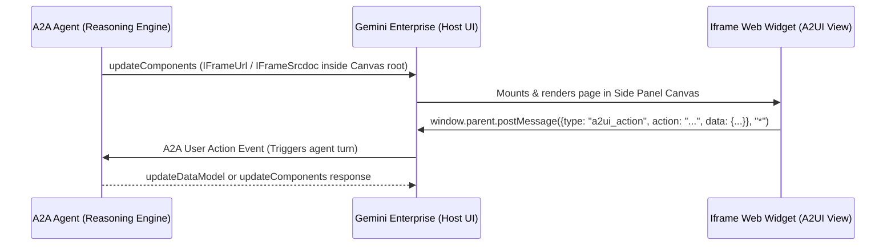

# A2UI Iframe Developer Skill

This skill provides comprehensive guidelines, architectural designs, code patterns, and API specifications for implementing custom iframe components (`IFrameUrl` and `IFrameSrcdoc`) in Agent-Driven User Interface (A2UI) v0.9 agents within Gemini Enterprise.

---

## 1. Architectural Overview

Gemini Enterprise supports embedding custom web-based user interfaces inside the chat console and side-panel Canvas via **A2UI v0.9**. This allows agents to present rich, interactive, and pre-built widgets (like maps, calendars, dashboards, or web apps).



---

## 2. Choosing the Right Component in v0.9

| Dimension | `IFrameSrcdoc` | `IFrameUrl` |
| :--- | :--- | :--- |
| **Primary Use Case** | Lightweight custom HTML widgets, self-contained interactive UI, form controls, charts. | Embedding existing external web apps, complex SPA frameworks (React/Vue), pages requiring network access. |
| **Root Container** | `Canvas` (for side panel) or `MaterialCard` (for in-chat cards). | **`Canvas`** (required for side panel embedding). |
| **Network Access** | **Strictly Blocked** (`connect-src 'none'` CSP required). | **Allowed** (requires allowlisted domain in Gemini Enterprise). |
| **Hosting Requirement** | **None**. Inline HTML string is generated dynamically by the agent. | **Yes**. Code must be hosted externally (e.g., Cloud Run, Firebase Hosting). |
| **Security Boundaries** | High. Restricts cross-site scripting and external exfiltration. | Standard sandboxed iframe boundaries + Host allowlist validation. |

---

## 3. A2UI v0.9 Schema Definitions

In A2UI v0.9, components use a **flat structure** declared inside `updateComponents` under the composite catalog (`https://www.gstatic.com/vertexaisearch/a2ui/v0_9/gemini_enterprise_composite_catalog.json`).

### 3.1 Root Component: `Canvas`
For side-panel iframe displays, `Canvas` **must** be the root component:

```json
{
  "id": "root",
  "component": "Canvas",
  "cardTitle": "Embedded Application",
  "cardDescription": "Open to view application in the side panel",
  "cardIcon": "public",
  "autoOpen": true,
  "children": ["url-frame"]
}
```

* `autoOpen: true`: Automatically opens and expands the canvas side panel when the response arrives.
* `cardTitle` / `cardDescription` / `cardIcon`: Controls the preview card displayed in chat.

---

### 3.2 `IFrameUrl` Schema
Renders an allowlisted URL inside a direct iframe using safe, intent-based src assignment.

```json
{
  "id": "url-frame",
  "component": "IFrameUrl",
  "url": "https://www.google.com/search?q=a2ui",
  "height": 650
}
```

* `url`: A string literal (or dynamic path reference `{"path": "/app/url"}`) specifying the target URL.
* `height`: Optional number specifying fixed height in pixels.

> [!WARNING]
> **Allowlist Requirement**: The Gemini Enterprise A2UI client component checks target URLs against an internal host allowlist. If the host is not in the allowlist, the widget will display: *"This UI element was blocked for security reasons. The content could not be displayed because it did not meet the required security policy."*

---

### 3.3 `IFrameSrcdoc` Schema
Renders dynamic inline HTML inside a network-restricted, sandboxed iframe.

```json
{
  "id": "html-frame",
  "component": "IFrameSrcdoc",
  "htmlContent": "<!DOCTYPE html><html><head><meta http-equiv=\"Content-Security-Policy\" content=\"connect-src 'none'\"></head><body style=\"margin:0;font-family:sans-serif;\"><h1>Custom UI</h1></body></html>",
  "height": 300
}
```

* `htmlContent`: The raw HTML string containing inline CSS and JavaScript.
* `height`: Desired height in pixels.

---

### 3.4 URL Intake Form Components
When prompting users for input prior to embedding (e.g. entering a target URL):
* **Use `MaterialInput` (NOT `MaterialTextField` or `TextField`)**:
  ```json
  {
    "id": "url_input",
    "component": "MaterialInput",
    "label": "Application URL",
    "placeholder": "https://example.com",
    "type": "text",
    "value": { "path": "/app/url" }
  }
  ```
* **Submit Button**:
  ```json
  {
    "id": "submit_btn",
    "component": "MaterialButton",
    "label": "Load Application",
    "variant": "raised",
    "action": {
      "event": {
        "name": "submit",
        "context": {
          "message": "Load Application",
          "app_url": { "path": "/app/url" }
        }
      }
    }
  }
  ```

> [!CAUTION]
> **Silent Component Dropping**: Unrecognized component names (such as `MaterialTextField` or `TextField` under the composite catalog) are silently skipped by the client-side renderer. If a form renders without the text field, check that the component name is strictly `MaterialInput`.

---

## 4. Complete Message Envelope Structure (v0.9)

```json
[
  {
    "version": "v0.9",
    "createSurface": {
      "surfaceId": "app_embedder",
      "catalogId": "https://www.gstatic.com/vertexaisearch/a2ui/v0_9/gemini_enterprise_composite_catalog.json",
      "theme": {
        "primaryColor": "#1a73e8",
        "font": "Roboto"
      }
    }
  },
  {
    "version": "v0.9",
    "updateComponents": {
      "surfaceId": "app_embedder",
      "components": [
        {
          "id": "root",
          "component": "Canvas",
          "cardTitle": "Active Application",
          "cardDescription": "Open to view application in the side panel",
          "cardIcon": "public",
          "autoOpen": true,
          "children": ["url-frame"]
        },
        {
          "id": "url-frame",
          "component": "IFrameUrl",
          "url": "https://example.com/app",
          "height": 650
        }
      ]
    }
  }
]
```

---

## 5. Bidirectional Communication via `postMessage`

To trigger conversational updates or agent actions from within the iframe, implement an event emitter inside the iframe:

```javascript
function sendActionToAgent(actionName, payload) {
  window.parent.postMessage({
    type: 'a2ui_action',
    action: actionName,
    data: payload
  }, '*');
}
```

The host intercepts this event and forwards it as a `userAction` / `data` payload to the agent executor.

---

## 6. Best Practices

1. **Always Use `Canvas` Root for Iframe Embeds**: Wrap `IFrameUrl` inside a `Canvas` root with `autoOpen: true` to ensure the side panel opens properly.
2. **Form Intake Component**: Always use `MaterialInput` (with `label`, `placeholder`, `value: {"path": "..."}`) for text entry in Gemini Enterprise composite catalog.
3. **Clean URL Strings**: Strip markdown link formatting (e.g., `[https://example.com](https://example.com/)` -> `https://example.com`) before passing to `IFrameUrl`.
4. **CSP for `IFrameSrcdoc`**: Always include `<meta http-equiv="Content-Security-Policy" content="connect-src 'none'">` in the `<head>` of any custom HTML.
